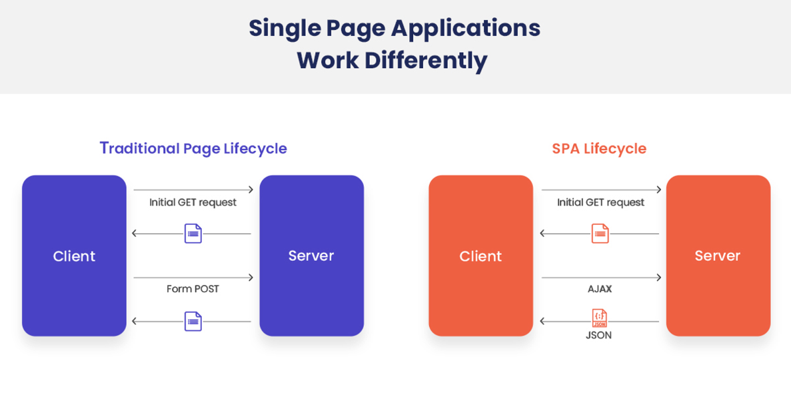
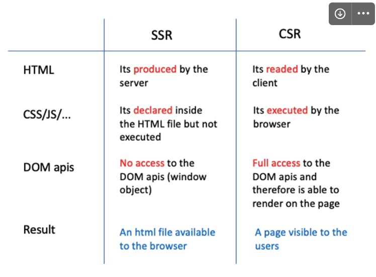
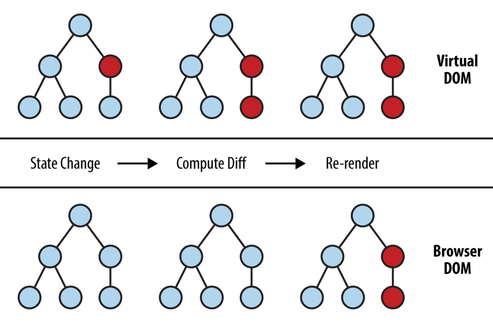
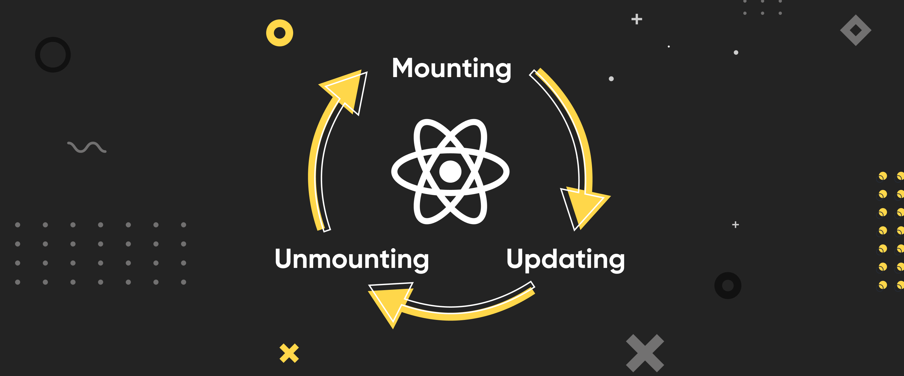

# 01.React란?

## 01. 소개

- 리액트는 UI(사용자 인터페이스) 제작을 도와주는 자바스크립트 라이브러리에요.
- 자바스크립트 라이브러이기 떄문에 cdn 등을 활용해서 간단하게 사용해 볼 수 있어요.

```jsx
<!DOCTYPE html>
<html lang="ko">
  <head>
    <meta charset="UTF-8" />
    <meta name="viewport" content="width=device-width, initial-scale=1.0" />
    <title>리액트 맛보기</title>
    <script src="https://cdnjs.cloudflare.com/ajax/libs/react/18.2.0/umd/react.production.min.js"></script>
    <script src="https://cdnjs.cloudflare.com/ajax/libs/react-dom/18.2.0/umd/react-dom.production.min.js"></script>
    <script src="https://unpkg.com/@babel/standalone/babel.min.js"></script>
  </head>
  <body>
    <div id="app"></div>

    <script type="text/babel">
      const appEl = document.getElementById("app");
      const root = ReactDOM.createRoot(appEl);

      const Greeting = () => <h1>Hello World</h1>;

      root.render(<Greeting />);
    </script>
  </body>
</html>
```

## 02. 등장 배경

전통적인 웹 개발에서 HTML, css, JavaScript는 각각 구조, 스타일, 동작을 담당하는 역할을 해왔어요.
하지만 이러한 방식에는 몇 가지 한계가 있었어요.

1. 유지보수의 어려움 : 웹 애플리케이션이 커질수록 HTML,CSS, JavaScript 코드 간의 상호작용이 복잡해지고, 이를 유지보수하기가 어려워 졌어요.
2. DOM 조작의 비효율성 : JavaScript를 사용한 직접적인 DOM 조작은 성능 저하를 가져올 수 있어요.
   DOM은 웹 페이지의 구조를 나타내므로, 자주 변경될 경우 브라우저의 랜더링 성능이 크게 저하될 수 있거든요.
3. 재사용성 부족 : 전통적인 방식에는 코드의 재사용성이 낮고, 동일한 기능을 다른 부분에서 사용하기 위해 코드를 반복 작성해야 하는 경우가 많았어요.

# 02. React를 사용한 웹 개발과 기존 웹 개발의 차이점

## 01. MPA → SPA



- 전통적인 웹 개발 방식은 Multi Page Application을 제작하는 것
- 리액트를 사용한 웹 개발 방식은 Single Page Application을 제작하는 것
  - SPA는 한 번의 페이지 로드로 전체 웹 서비스에 필요한 모든 콘텐츠를 동적으로 렌더링하는 웹 애플리케이션 방식이에요.
  - 사용자의 상호작용에 따라 필요한 부부만 JavaScript를 통해 갱신해요. 그래서 전체 페이지를 새로 불러오는 대신, 필요한 데이터만 주고받을 수 있죠.
  - 이 방식은 빠른 페이지 반응성과 부드러운 사용자 경험을 제공해줘요.

## 02. SSR → CSR



- 전통적인 웹 개발 방식은 Server Side Rendering
- 리액트를 시용하는 웹 개발 방식은 Client Side Rendering

# 03. React 프로젝트 만들기

## 01. Creat React App(CRA)

```bash
npx create-react-app my-app
```

## 02. Vite

```bash
npm create vite@latest
```

# 04. React 주요 개념

## 01. 가상DOM



- 가상 DOM은 <span style="color:magenta">실제 DOM을 흉내 낸</spna> 가상의 DOM이에요.
- React 같은 라이브러리는 가상 DOM을 사용해서 실제 DOM보다 빠르게 UI 변경사항을 관리해줘요.
- 가상 DOM은 변경이 필요한 부분만 실제 DOM에 반영해줘서, 페이지 전체를 새로 불러오는 것보다 훨씬 효율적이에요.
- 개발자 입장에서도 DOM을 직접 다루는 대신 React가 가상 DOM을 이용해 필요한 부분만 자동으로 업데이트해주니 훨씬 편리하게 그리고 높은 생산성으로 서비스를 만들 수 있어요.

## 02. JSX

### 01. JSX란?

- JSX는 JavaScript를 확장한 문법으로, React에서 UI 구조를 표현하는 데 사용돼요.
- HTML 태그와 유사하게 생겼지만, 실제로는 JavaScript의 확장이에요. 절대 혼돈해서는 안 되어요!

```
❗ HTML 태그 <h1>과 JSX <h1>은 완전히 다른 것이에요!
```

- JSX는 React 라이브러리의 createElement 함수 호출을 보다 직관적으로 표현해주는 문법적 편의를 제공하는 데에 불과하니 겁먹지 마세요!

### 02. JSX의 특징

#### 1. HTML과 유사한 문법

- JSX는 HTML 태그와 비슷하게 생겼기 때문에, 웹 개발자에게 친숙하고 읽기 쉬워요.

#### 2. JavaScript와의 결합

- JSX 내에서 JavaScript 표현식을 중괄호 {}로 묶어 사용할 수 있어요.
- 이를 통해 데이터 바인딩이나 반복문 처리 등이 가능해요

```jsx
function App() {
  const name = "LeeIn";

  return <div>Hello~! My name is {name}.</div>;
}
```

#### 3. 컴포넌트 기반

- React 컴포넌트 JSX를 사용하여 리액트 엘리먼트로 만들 수 있어요.
- 이를 통해 UI를 구조화하고 재사용할 수 있어요.

### 03. JSX 사용 예시

```jsx
// 컴포넌트 선언
function SomeComponent() {
  return <h1>{3 + 5}</h1>;
}

// 엘리먼트 생성
const someElement = <SomeComponent />;

// 컴포넌트의 재사용
function AnotherComponent() {
  return (
    <div>
      <SomeComponent />
      <SomeComponent />
    </div>
  );
}
```

### 04. JSX의 장점

- 읽기 쉽고 작성하기 편리
  UI 코드가 시각적으로 이해가ㅣ 쉬워, 개발 효율성이 높아집니다.
- 컴포넌트 구조 명확화
  컴포넌트의 구조를 한눈에 파악하기 쉬워, 프로젝트의 유지보수성이 향상됩니다.

### 05. JSX 사용 시 주의사항

- 브라우저는 JavaScript의 확장인 JSX는 읽지 못하고 JavaScript만 읽을 수 있어요.
- 따라서 트랜스파일러(Babel 등)을 사용하여 JSX를 일반 JavaScript로 변환하여 웹 브라우저에 보내주어야 해요.

## 03. React Component vs React Element

### 01. 리액트 컴포넌트 (React Component)

- 리액트 컴포넌트는 UI의 한 부분을 캡슐화한 코드 블록이에요.
- 과거에는 클래스를 사용하여 컴포넌트를 만들었지만 이제는 함수로 만드는 것이 일반적이애요.

```jsx
function Greeting() {
  return <div>Hello World</div>;
}
```

### 02. 리액트 엘리먼트 (React Element)

- <span style="magenta">리액트 엘리먼트는 컴포넌트의 인스턴스</span>로, 화면에 표시할 내용을 기술한 객체에요.
- JSX 문법을 사용하여 생성할 수 있어요.

```jsx
<Greeting />
```

## 04. State

- state는 React 컴포넌트 내부의 동적인 데이터를 관리하는 데 사용되는 데이터 구조에요.
- 일반적으로 시간에 따라 변하는 값이나 사용자의 상호작용 또는 네트워크 응답 등에 의해 변경되는 값을 State로 관리해요.
- State가 바뀌면 컴포넌트는 리랜더링을 해요.
- 리랜더링이 된다는 것은 함수가 재실행된다는 뜻이고, 그 결과 화면이 다시 그려지게 되어요.
- 함수는 재실행되지만 상태값은 어딘가에 계속 기억이 되고 있답니다.

```jsx
import React, { useState } from "react";

function Counter() {
  const [count, setCount] = useState(0); // 초기값 0

  const increment = () => {
    setCount(count + 1); // count를 1 증가시키는 함수
  };

  return (
    <div>
      <p>현재 카운트: {count}</p>
      <button onClick={increment}>증가</button>
    </div>
  );
}
```

## 05. Props

- 부모 컴포넌트로부터 자식 컴포넌트에 전달하는 데이터를 Props 라고 해요.
- 자식 컴포넌트 입장에서 Props는 읽기 전용으로, 수정해서는 안돼요.
- props를 잘 사용하면 컴포넌트의 재사용성과 유연성이 크게 증가해요.
- 부모가 전달해 주는 props 값이 바뀌면 자식 컴포넌트는 리랜더링을 해요.

```jsx
function Greeting(props) {
  return <h1>안녕하세요, {props.name}님!</h1>;
}

function App() {
  const someName = "철수";
  return (
    <div>
      <Greeting name="지수" />
      <Greeting name={someName} />
    </div>
  );
}
```

## 06. 리랜더링의 조건

1. state가 변경되면 컴포넌트는 리렌더링된다.
2. 부모 컴포넌트로부터 전달 받는 props의 값이 변경되면 컴포넌트는 리렌더링된다.
3. 부모 컴포넌트가 리렌더링되면 자식 컴포넌트는 리렌더링된다.

## 07. React Component의 생애주기




# 05. 기타

## 주특기 입문 주차 학습 목표

✅ 가상돔 (Virtual DOM)

✅ 구조분해할당 (Destructuring Assignment)

✅ Vite를 사용한 개발 환경 구축 방법

✅ 부모 컴포넌트와 자식 컴포넌트 사이에서 데이더를 전달하는 방식

✅ JSX 문법과 HTML 문법의 차이

✅ Props와 State의 역할과 차이점

✅ 불변성(Immutability)의 원칙과 순수 함수의 개념 및 역할

✅ 반복되는 컴포넌트를 처리하고 분리하는 방법
